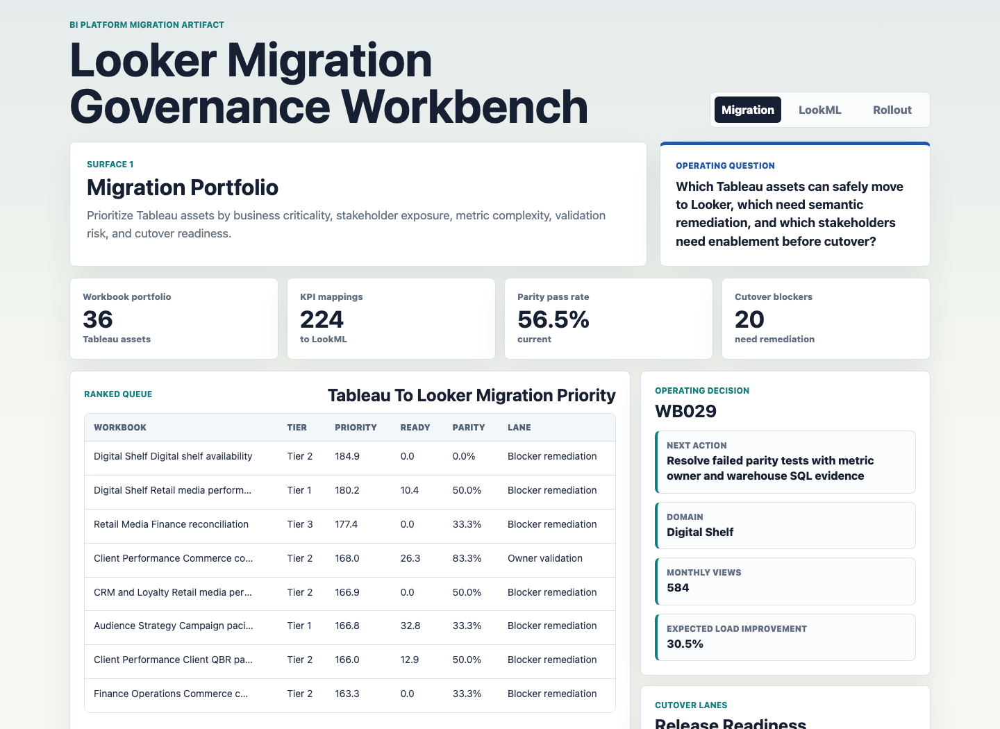
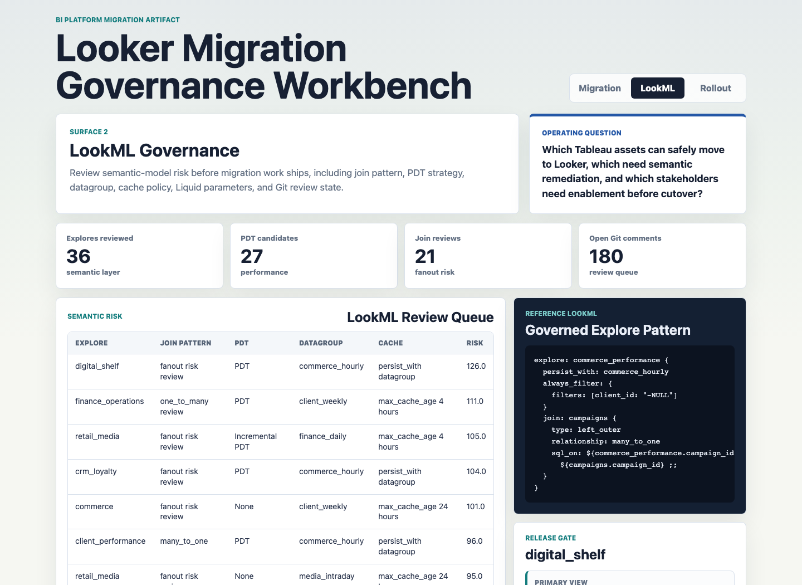
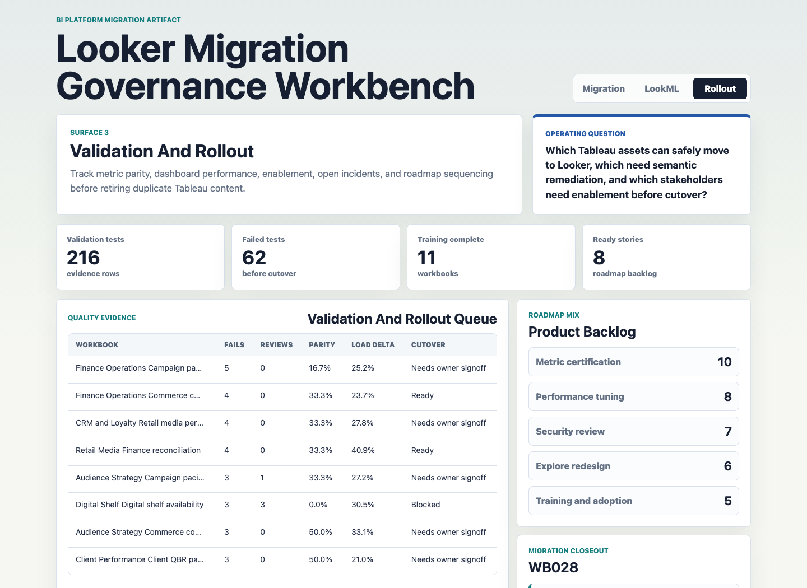

# Looker Migration Governance Workbench

An interactive BI platform portfolio artifact for a multi-brand digital experience and commerce analytics organization migrating a large Tableau portfolio into Looker.

The workbench treats migration as a product-owned governance program, not a dashboard rebuild queue. It connects Tableau discovery, KPI-to-LookML translation, validation evidence, performance tuning, Git review, stakeholder enablement, and roadmap sequencing into one operating artifact.

## Screenshots



**Migration portfolio:** ranks Tableau workbooks by business criticality, usage, metric complexity, validation risk, readiness, and the next action needed before Looker cutover.



**LookML governance:** reviews semantic-layer risk across Explores, join patterns, PDT strategy, datagroups, cache policies, Liquid parameters, style-guide findings, and Git review status.



**Validation and rollout:** tracks metric parity, performance improvement, cache hit rate, incidents, training status, adoption risk, and roadmap backlog before Tableau content is retired.

## What This Demonstrates

- Large-scale Tableau to Looker migration planning with migration waves, readiness scoring, and cutover lanes.
- Hands-on Looker and LookML governance through Explores, Views, PDTs, datagroups, caching policy, Liquid parameters, and Git review controls.
- KPI translation discipline from Tableau calculated fields into LookML measures, dimensions, filtered measures, and parameterized fields.
- Data validation thinking across parity tests, row counts, filter behavior, row-level security evidence, freshness, and SQL explain checks.
- BI product ownership through roadmap backlog, stakeholder enablement, incident tracking, release gates, and stakeholder-ready recommendations.

## Artifact Surfaces

1. **Migration portfolio command center:** identifies which Tableau assets should move first and which are blocked by semantic, quality, or adoption risk.
2. **LookML governance workbench:** shows how Looker assets should be reviewed before production release.
3. **Validation and rollout control room:** connects source-to-target parity, performance evidence, training, incidents, and roadmap items.
4. **Evidence layer:** includes generated CSVs, LookML examples, SQL checks, deterministic scoring, data dictionary, analysis plan, and executive findings.

## Data

All data is synthetic and labeled as synthetic. It does not represent real company performance, client reporting, media spend, CRM data, commerce revenue, customer data, employee data, or confidential BI metadata.

Synthetic data is appropriate because real Tableau inventories, Looker projects, stakeholder usage, client metrics, security rules, and migration defects are normally confidential. The generated structure models common enterprise BI migration objects in a digital experience, CRM, commerce, retail media, client reporting, and finance analytics environment.

Generated datasets:

| File | Grain | Purpose |
|---|---:|---|
| `data/workbooks.csv` | Tableau workbook | Inventory, owner, audience, criticality, usage, complexity, extract age, RLS, and baseline performance |
| `data/metrics.csv` | KPI field | Tableau formula to LookML field mapping, parity status, owner, and certification status |
| `data/lookml_assets.csv` | Looker Explore | Model, Explore, view, joins, PDT strategy, datagroup, cache policy, Liquid parameter, and Git review state |
| `data/validation_tests.csv` | Validation test | Metric parity, row count, filter behavior, RLS, freshness, and SQL explain evidence |
| `data/performance_samples.csv` | Workbook performance sample | Tableau baseline load, Looker target load, query cost, cache hit rate, and PDT build time |
| `data/stakeholder_rollout.csv` | Workbook rollout | Training, adoption, incidents, sentiment, and cutover readiness |
| `data/roadmap_backlog.csv` | Product backlog item | Epic, user story, impact, effort, release target, and status |

The generator uses a fixed random seed and models these assumptions:

- Higher-criticality workbooks receive more stakeholder exposure and stricter cutover expectations.
- Assets with more calculated fields, data sources, custom SQL, and dashboard tabs receive higher migration complexity.
- Parity failures are more common where Tableau assets have many uncertified metrics.
- PDTs, incremental PDTs, and aggregate awareness are assigned to assets with heavier semantic-model or performance needs.
- Datagroups model hourly commerce, daily CRM, intraday media, daily finance, and weekly client reporting refresh patterns.
- Looker performance is modeled as an improvement over Tableau baseline load time, but performance improvement does not override parity and owner-signoff requirements.

## Scoring Method

`scripts/score_operating_data.py` creates three deterministic outputs:

- `analysis/outputs/migration_priority_queue.csv`
- `analysis/outputs/lookml_governance_queue.csv`
- `analysis/outputs/validation_rollout_queue.csv`

Migration priority combines business criticality, usage, stakeholder exposure, workbook complexity, failed validation tests, metric review count, and rollout penalties.

Readiness score subtracts risk for failed parity tests, uncertified metrics, open Git comments, style findings, incomplete training, at-risk adoption, and blocked cutover status.

Semantic risk score combines open LookML review comments, style-guide findings, metric parity review count, and nonstandard join patterns.

Each workbook lands in one cutover lane:

- `Ready for Looker cutover`
- `Owner validation`
- `Blocker remediation`

## Role Connection

This artifact maps directly to a Looker BI Developer or BI platform product-owner role responsible for:

- Migrating Tableau dashboards and reports to Looker.
- Translating Tableau logic into governed LookML.
- Designing Explores, Views, PDTs, datagroups, caching policies, and reusable semantic definitions.
- Managing Git-based LookML review workflows.
- Testing data consistency and metric parity against source systems.
- Communicating migration risk, roadmap priority, and rollout readiness to technical and non-technical stakeholders.

## Run Locally

```bash
npm run generate
npm run analyze
npm start
```

Then open `http://127.0.0.1:4307`.

If port 4307 is already in use, run:

```bash
python3 -m http.server 4310
```

## Repository Map

```text
data/                         Synthetic source datasets
analysis/                     SQL checks, analysis plan, findings, and generated outputs
lookml/                       Reference LookML model and view files
scripts/generate_migration_data.py
scripts/score_operating_data.py
src/                          Browser UI JavaScript and CSS
docs/images/                  Screenshots for the three artifact surfaces
```

## Scope

This artifact does:

- Provide a working static workbench with three distinct migration, governance, and rollout surfaces.
- Include synthetic data, deterministic scoring, SQL checks, LookML examples, documentation, and screenshots.
- Show how a BI platform owner could govern Tableau-to-Looker migration with validation and release controls.

This artifact does not:

- Connect to a live Tableau Server, Tableau Cloud, Looker instance, Git provider, or cloud warehouse.
- Use real client, customer, media, CRM, commerce, finance, employee, or confidential BI data.
- Claim that the synthetic metrics represent actual performance from any organization.
- Replace formal security review, data governance tooling, production LookML validation, or platform administration.
